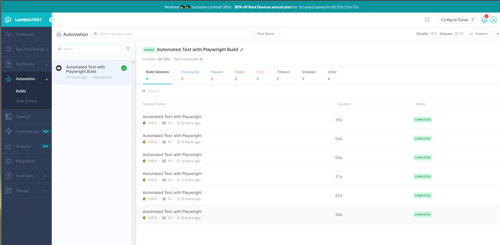
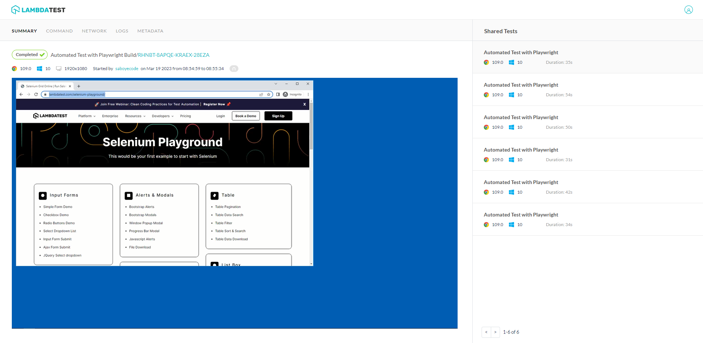
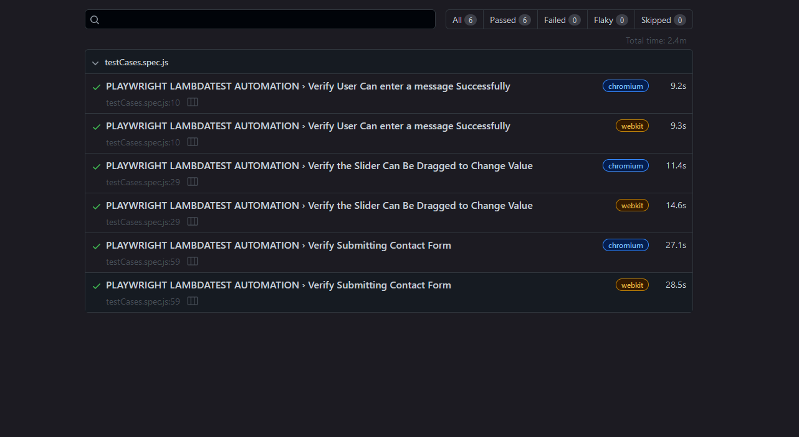

<p align="justify">
<h1 align="center" style="color:blue;" id="heading"> Automated Test with Playwright </h1>
<h1 align="center" style="color:blue;" id="heading"> Run on the Cloud </h1>
</p>


<p align="center">


</p>


<!-- PROJECT LOGO -->
<br />
<p align="center">
  <a>
    
  </a>
</p>


This is a test suite built with [Playwright](https://playwright.dev/) that tests the [LambdaTest](https://www.lambdatest.com/selenium-playground/) platform. The test suite includes three test cases that cover different aspects of the website:

[System under test (SUT)](https://www.lambdatest.com/selenium-playground/)

- Verify User Can enter a message Successfully
- Verify the Slider Can Be Dragged to Change Value
- Verify Submitting Contact Form


# Running the Test Suite

To run the test suite,  clone this repository to your local machine and you will need to have Node.js and Playwright installed on your machine. You can install them by running the following commands:

```ruby
  git clone https://github.com/saboye/Automated-Test-with-Playwright.git
  
  cd Automated-Test-with-Playwright
```

```ruby
npm install

```

Then, you can run the test suite using the following command:

```ruby
npx playwright test
```

By default, the test suite runs on the Chromium browser. If you want to run the tests on a different browser, you can use the --browser option. For example, to run the tests on Firefox, you can use the following command:

# Test Cases
## Verify User Can enter a message Successfully
This test case verifies that a user can successfully enter a message on the "Simple Form Demo" page and that the displayed message matches the entered message.

## Verify the Slider Can Be Dragged to Change Value
This test case verifies that a user can drag the slider on the "Drag & Drop Sliders" page to change its value and that the displayed value matches the expected value.

## Verify Submitting Contact Form
This test case verifies that a user can successfully submit the contact form on the "Input Form Submit" page. It fills in the a;; the form fields  verifies that the success message "Thanks for contacting us, we will get back to you shortly." is displayed.

# Test Report 
This report will include both the HTML and the LambdaTest results along with the details of the build setup used on LambdaTest.

## Builds on Lamdatest 
<p align="center">
  <a>
    
  </a>
</p>

## Test Report on Lamdatest 
<p align="center">
  <a>
    
  </a>
</p>

## Playwright HTML Report 
<p align="center">
  <a>
    
  </a>
</p>

# Technologies Used 

- 🎭 [playwright](https://playwright.dev/) 
- [Node.js](https://nodejs.org/en)

# License
This project is licensed under the MIT License - see the [LICENSE](https://github.com/saboye/Automated-Test-with-Playwright/blob/main/LICENSE) file for details.

